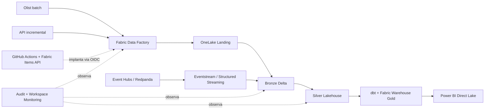
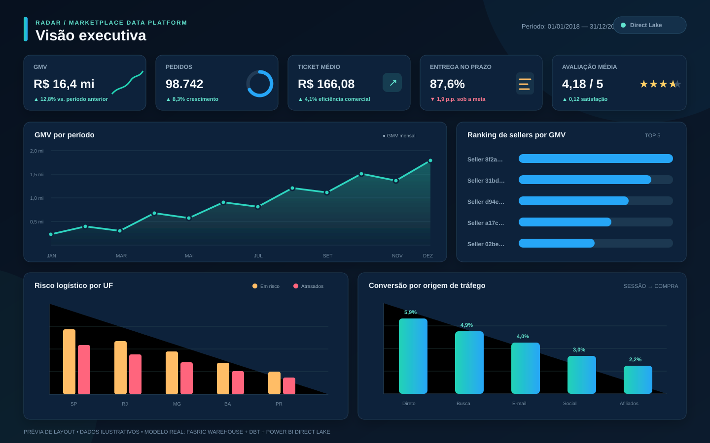

# Radar — Marketplace Data Platform

[](https://github.com/Ygormorais/radar-marketplace-data-platform/actions/workflows/ci.yml)
[](https://github.com/Ygormorais/radar-marketplace-data-platform/actions/workflows/integration.yml)
[](LICENSE)

Plataforma de engenharia de dados para um marketplace brasileiro, construída para demonstrar uma arquitetura profissional com Microsoft Fabric, Spark, Delta Lake, SQL, dbt, streaming, qualidade e CI/CD.

> **Status:** código end-to-end concluído e validado por CI. A execução no tenant Fabric, o binding Direct Lake e a exportação Gold permanecem atividades dependentes de ambiente; o dashboard web versionado usa um snapshot sintético identificado por `metadata.mode=demo`.

## Evidências verificáveis

- [GitHub Actions](https://github.com/Ygormorais/radar-marketplace-data-platform/actions): lint, type-check, testes Python, contratos dbt/Power BI, Docker Compose e aplicação web;
- [`fabric/notebooks`](fabric/notebooks): notebooks PySpark versionados no formato nativo do Fabric;
- [`fabric/pipelines`](fabric/pipelines): orquestração batch e supervisor de streaming;
- [`dbt`](dbt): staging, fatos, dimensões, marts, testes genéricos e singulares;
- [`powerbi/Radar.pbip`](powerbi/Radar.pbip): modelo semântico TMDL e relatório PBIR revisáveis em Git;
- [`docs/architecture/architecture.md`](docs/architecture/architecture.md): arquitetura, responsabilidades e trade-offs;
- [`docs/portfolio-presentation.md`](docs/portfolio-presentation.md): checklist das evidências que dependem do tenant.

## Objetivo de negócio

Consolidar vendas, pagamentos, logística, sellers, comportamento de navegação e qualidade operacional para responder, entre outras perguntas:

- onde e por que entregas violam o SLA;
- como atrasos afetam avaliações, recompra e LTV;
- quais sellers e rotas concentram risco operacional;
- qual é a conversão entre sessão, carrinho, pedido e pagamento;
- se GMV, receita, pagamentos, cancelamentos e devoluções estão reconciliados.

## Arquitetura-alvo



Decisões detalhadas estão em [`docs/architecture/architecture.md`](docs/architecture/architecture.md) e nos ADRs de [`docs/adr`](docs/adr).

## Prévia do dashboard



Os valores da imagem são ilustrativos; os visuais PBIR reais estão ligados às marts Gold. Veja o contrato e as instruções em [`docs/power-bi.md`](docs/power-bi.md).

Uma aplicação web interativa e independente do tenant está em [`web`](web). Ela oferece filtros, páginas executiva/logística/funil/qualidade e consome um snapshot agregado das mesmas marts. A arquitetura e o contrato de anonimização estão em [`docs/web-dashboard.md`](docs/web-dashboard.md).

**Dashboard navegável:** [abrir Radar Web](https://commercepulse-fabric.patriciadistemas.chatgpt.site). O snapshot publicado é sintético e permanece identificado como demonstrativo no próprio produto e em seus metadados.

## O que existe neste checkpoint

- pacote Python instalável em `src/radar`;
- configuração YAML tipada e sobreposição segura por ambiente;
- contrato JSON Schema e modelo Pydantic do evento logístico v1;
- extração segura e manifesto SHA-256 do dataset Olist;
- gerador determinístico de eventos válidos, duplicados e atrasados;
- produtor idempotente para Kafka/Redpanda, particionado por pedido;
- Redpanda e console em Docker Compose;
- testes unitários e de contrato;
- lint, type-check, cobertura e GitHub Actions.
- contratos explícitos para as nove fontes Olist, sem `inferSchema`;
- ingestão Bronze idempotente por hash de arquivo e registro;
- quarantine para registros malformados, campos obrigatórios e duplicatas;
- audit log Delta append-only com métricas de execução;
- parser de streaming, watermark, deduplicação e `MERGE` por `event_id`;
- supervisor near-real-time com `availableNow`, checkpoints independentes e telemetria por query;
- SLOs de heartbeat/quarentena/qualidade, alert outbox Delta e runbook de incidentes;
- gerador Spark distribuído para 7 milhões de eventos por 1 milhão de pedidos;
- notebooks Fabric batch, streaming e benchmark em formato source-control.
- entidades Silver conformadas e nomes inconsistentes da fonte corrigidos;
- CDC current-state protegido contra eventos fora de ordem;
- SCD2 atômica para customer, seller e product;
- reconciliação financeira por pedido com valores decimais;
- accumulating snapshot logístico e validação de transições;
- sessionização clickstream e flags do funil;
- expectativas, integridade referencial e quality gate antes da Gold.
- projeto dbt para Fabric Warehouse com 5 staging models, 8 dimensões/bridge, 6 fatos e 5 marts;
- testes dbt genéricos e singulares para integridade, SCD2, transições e valores financeiros;
- constraints PK/FK `NOT ENFORCED`, segurança e consultas T-SQL com windows, gaps-and-islands e CTEs;
- modelo semântico TMDL Direct Lake com relacionamentos e medidas DAX;
- relatório Power BI em PBIP/PBIR com páginas executiva, logística, funil e sellers;
- dashboard web responsivo com ECharts, exportação DuckDB/Parquet e build Cloudflare-compatible.
- pipeline batch Fabric com manifesto auditável, paralelismo Silver, retries e quality gate;
- serving condicionado: `quality gate → dbt build --fail-fast → refresh semântico`;
- deployment idempotente de notebooks/pipelines pela Fabric Items API, dry-run e GitHub OIDC.

Dados reais e sintéticos nunca são misturados silenciosamente: todo evento sintético contém `attributes.synthetic=true` e o seed utilizado.

## Início rápido

Requer Python 3.11–3.13. Docker é opcional neste sprint.

```powershell
./scripts/bootstrap.ps1 -WithStreaming
./.venv/Scripts/Activate.ps1
python -m pytest
```

Gere um arquivo determinístico:

```powershell
python scripts/generate_events.py `
  --order-count 1000 `
  --seed 20260818 `
  --output data/generated/delivery-events.jsonl
```

Para usar os IDs reais da Olist:

```powershell
python scripts/generate_events.py `
  --orders-csv data/raw/olist/v1/olist_orders_dataset.csv `
  --output data/generated/delivery-events.jsonl
```

## Dataset Olist

O projeto não redistribui os dados. Baixe o ZIP em [Brazilian E-Commerce Public Dataset by Olist](https://www.kaggle.com/datasets/olistbr/brazilian-ecommerce) e execute:

```powershell
python scripts/download_olist.py --archive C:/Downloads/archive.zip
```

O comando aceita somente os nove CSVs esperados, rejeita dataset incompleto e cria `data/raw/olist/v1/_manifest.json` com origem, tamanho, contagem de linhas e SHA-256.

## Streaming local

```powershell
docker compose -f infrastructure/docker/compose.yml up -d --wait
python scripts/publish_events.py `
  --input data/generated/delivery-events.jsonl `
  --topic delivery-events-v1
```

Para o clickstream:

```powershell
python scripts/generate_clickstream.py --user-count 1000 --output data/generated/clickstream-events.jsonl
python scripts/publish_events.py `
  --input data/generated/clickstream-events.jsonl `
  --topic clickstream-events-v1 `
  --key-field user_id
```

O Redpanda Console estará em `http://localhost:18080`. O broker externo estará em `localhost:19092`.

## Execução Bronze no Fabric

Os notebooks versionados estão em [`fabric/notebooks`](fabric/notebooks). O pipeline deve fornecer:

- `run_id` único;
- caminhos do Lakehouse;
- mapa JSON `source_name → SHA-256` derivado do manifesto;
- configurações Kafka/Event Hubs resolvidas por conexão segura.

O notebook batch falha antes da leitura caso qualquer hash esteja ausente. Em retry, registros já existentes não são reinseridos e a métrica `rows_written` retorna zero.

## Configuração

A precedência é:

```text
config/base.yml < config/<ambiente>.yml < RADAR__SECAO__CHAVE
```

Exemplo:

```powershell
$env:RADAR_ENVIRONMENT = "local"
$env:RADAR__GENERATOR__SEED = "42"
```

Chaves desconhecidas são rejeitadas. Segredos não pertencem aos YAMLs: localmente devem vir de variáveis de ambiente e, no Fabric, de identidade gerenciada/Key Vault.

## Qualidade local

```powershell
python -m ruff check .
python -m ruff format --check .
python -m mypy
python -m pytest --cov=radar --cov-report=term-missing
dbt parse --project-dir dbt --profiles-dir dbt --no-partial-parse
npm ci
npx --no-install powerbi-report-author validate powerbi/Radar.pbip --format text
```

## Roadmap

1. Fundação, contratos, dados e CI.
2. Landing/Bronze batch e streaming idempotentes.
3. Silver, CDC, SCD2, qualidade e reconciliação.
4. Gold dimensional, dbt e SQL analítico. **Concluído.**
5. Orquestração Fabric, observabilidade e deployment. **Concluído.**
6. Modelo semântico, Power BI e material de apresentação. **Concluído.**
7. Dashboard público no navegador. **Concluído.**

O mapeamento técnico com vagas recentes está em [`docs/market-mapping.md`](docs/market-mapping.md). O roteiro de publicação, capturas e vídeo está em [`docs/portfolio-presentation.md`](docs/portfolio-presentation.md).

## Licença

Código sob licença MIT. Os datasets mantêm suas próprias licenças e termos de uso.

Projeto desenvolvido por [Ygor Morais](https://github.com/Ygormorais).
